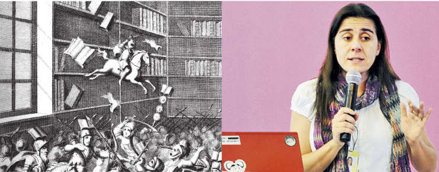

### **Beatriz Busaniche, presidente de Fundación Vía Libre**

### 7 Oct 2016 20hs, Salón Blanco de la Municipalidad de Río Cuarto.

#### Presentación a cargo de Lila Pagola y Javier Blanco.

**¿Cómo compatibilizar el derecho de autor con el derecho de acceso y participación a la cultura que promueven y protegen diversos instrumentos de derechos humanos? El libro aborda esta cuestión a través de un estudio pormenorizado de los principales pactos de Derechos Humanos y tratados internacionales de propiedad intelectual. Adopta una perspectiva histórica para mostrar las discusiones, sumamente vigentes, que tuvieron lugar durante las negociaciones para incluir los derechos culturales en los instrumentos de derechos humanos. Analiza las tensiones entre el marco normativo de derechos humanos y los tratados comerciales. Brinda claves y propuestas para la construcción de una ley de derechos autorales que promueva el ejercicio de los derechos culturales.**

- Autora: *Beatriz Busaniche*
- Editores: Fundación Vía Libre y Tren en movimiento, con el apoyo de la Fundación Heinrich Böll.
- Año de publicación: 2016

Se puede descargar libremente el libro en el siguiente link [PIyDH_Busaniche](
http://www.vialibre.org.ar/wp-content/uploads/2016/04/piydh_busaniche.pdf)

### Algunas entrevistas a Beatríz sobre el tema

- [Las tensiones entre el derecho a la cultura y el derecho de autor](https://www.youtube.com/watch?v=No5H0WWcO-8)
- [Derecho de autor como derecho humano](https://www.youtube.com/watch?v=rPvkHoaxeXo)
- [Curso sobre Derecho de Autor](https://www.youtube.com/watch?v=u1NMZlh3UMQ)
- [Día del Libro y del Derecho a Leer](https://www.youtube.com/watch?v=rxGqkkaBLnc)
- [Los abusos del derecho de autor](https://www.youtube.com/watch?v=olM2HE7iUgY)
- [Derechos de autor y fotocopias](https://www.youtube.com/watch?v=gAF6_vjxl68)
- [Beatriz Busaniche sobre la cultura, la privacidad y los derechos en Internet](https://www.youtube.com/watch?v=lCQ_GA1nmtk)
- [Polémica por la violación a los derechos de autor](https://www.youtube.com/watch?v=b-CbrmCW1vY)
- [Copyright vs Copyleft](https://www.youtube.com/watch?v=smBuZdpCL1o)
- [¿De quién son tus ideas?](https://www.youtube.com/watch?v=c-0tEvw1i4s)

### Organiza

Secretaría de Extensión  
Programa de difusión y uso del Software Libre  
Cátedra abierta Florial Gorini  
Facultad de Ciencias Económicas (UNRC).

